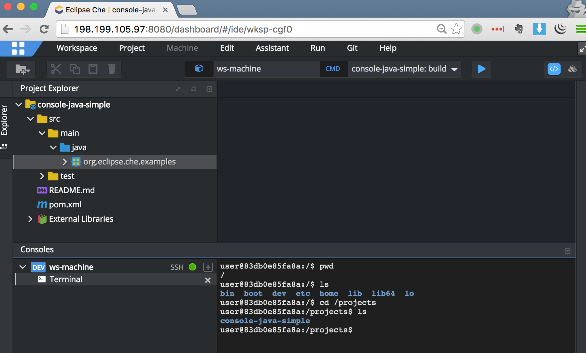

如何访问che
-----------

启动che后，我们就可以打开浏览器，输入：<http://198.199.105.97:8080>。

默认情况下，它会打开`/dashboard`页面，我们可以来创建一些workspace或者project，之后就可以打开IDE页面，进行文件的编辑，以及运行各种命令。

一些值得注意的功能：

### 1. Terminal

可以直接ssh到workspace machine，执行各种操作。

对于che来说是很好的功能补充，可以方便得做各种它没有提供或者不太好用的功能，比如git提交什么的。

### 2. 访问内部服务

每个workspace machine内部都可以有多个服务。如果我们在workspace对应的recipe里声明了需要暴露的端口后，che会自动把一个外部可访问的端口映射到machine中对应的内部端口。

比如在上图中，用户就可以访问：<http://198.199.105.97:33731> 来访问该machine中的`8080`端口。