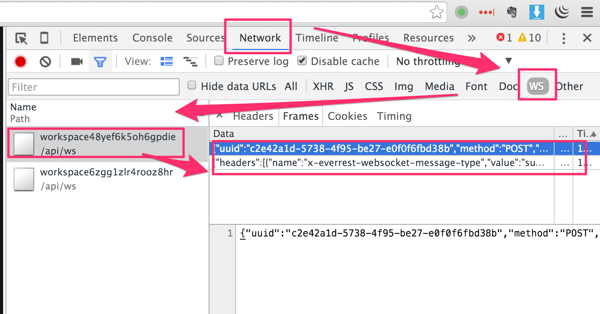

如何使用Chrome及其它工具来监听请求
---------------------

### 1. HTTP请求


### 2. Websocket请求




### 3. Advanced REST Client

安装地址：<https://chrome.google.com/webstore/detail/advanced-rest-client/hgmloofddffdnphfgcellkdfbfbjeloo/reviews?hl=en-US&utm_source=ARC>


### 4. curl

curl比较常用，不详细说明了。提示，我们可以在<http://198.199.105.97:8080/swagger/>里执行了某个API后，它会把对应的`curl`的代码显示出来，非常贴心。


```
curl -X POST --header 'Content-Type: application/json' --header 'Accept: application/json' -d '{}' 'http://198.199.105.97:8080/api/auth/login'
```

### 5. wscat

这是一个websocket的命令行工具，它的功能比前面介绍的Advanced REST Client更加强大。比如wscat还支持subprotocol，而Advanced REST Client不支持。但在我们这里，目前还用不上这个功能。

安装：

```
npm install -g wscat
```

使用：

```
~ $ wscat -c ws://198.199.105.97:8080/api/ws/workspace6zgg1zlr4rooz8hr
connected (press CTRL+C to quit)
> {"uuid":"fbcbcc6f-8b27-4e53-fc15-2682421bb5ee","method":"POST","path":null,"headers":[{"name":"x-everrest-websocket-message-type","value":"subscribe-channel"}],"body":"{\"channel\":\"vfs\"}"}
  < {"headers":[{"name":"x-everrest-websocket-message-type","value":"subscribe-channel"}],"method":"POST","responseCode":200,"uuid":"fbcbcc6f-8b27-4e53-fc15-2682421bb5ee","body":"{\"channel\":\"vfs\"}"}
>
```
