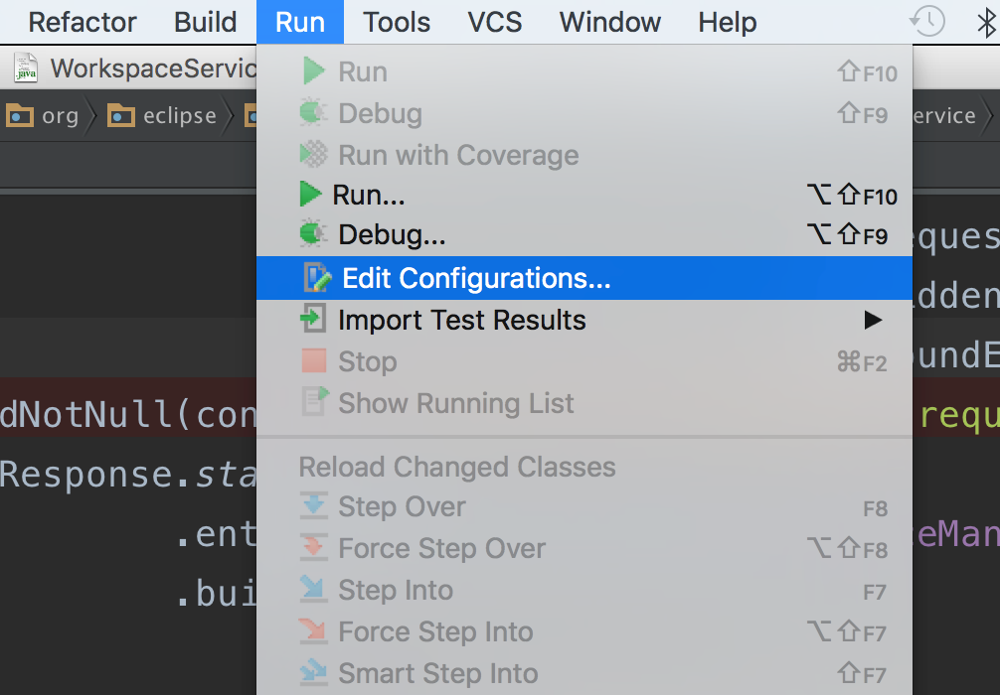

开发人员如何远程调试che
====================

如果我们要在che基本上来开发，难免有时候会遇到一些奇怪的bug，这时我们可能会借助单步调试。

che的远程调试与其它的Java程序相比并无区别，只不过它的主要功能是运行在一个tomcat容器中，所以它的设置也主要是基于tomcat。

如果不清楚Java的远程调试，可以看一下这个示例：<https://github.com/java-demos/jdb-debugging-demo>

由于我们通常有两种方式运行che：手动编译源代码并启动che，以及以docker方式来运行。这两种的调试手段是一样的，但是在服务器端的设置方式会有所不同。

实际上对于开发来说，使用docker方式来远程调试并不是一个好的选择，因为我们很难知道docker中运行che到底对应于代码库中的哪一个git commit。这样会导致本地源代码与服务器上运行的代码之间对应不上，产生各种奇怪的错误。还是建议在服务器上或者本地，使用源代码编译出一个che，然后在它的基本上进行远程调试。

但为了完整性，这里还是同时列出了两种方式。

`che.sh`方式启动che
------------------

`che.sh`脚本提供了一个`-d`（即`--debug`）参数，用于开启服务器端的远程调试参数，我们只需要把这个参数简单的传入`che.sh`脚本即可。

如果在che.sh中我们选择了Java程序方式启动（不传入`-i`参数)，则它会在调用tomcat相关命令时传入合适的参数；如果选择了docker image方式（使用了`-i`参数），则它会拼装出一个新的包含了调试配置的命令传给`docker run`，以实现该功能。

对于开发来说，我们推荐自己由源代码编译出`che.sh`然后以java方式启动。

启动之后，检查console上的输出里是否有：

```
USE_DEBUG: true
```

成功的话，che中的tomcat就在`8000`端口上开启了远程调试，我们就可以使用一些客户端工具来连接上去了。

docker方式启动
-------------

如果我们没有使用`che.sh`，而是直接用docker的方式启动（如`docker run ... codenvy/che`），则要麻烦一些。

因为docker的Dockerfile的限制，不方便把`-d`参数传入到docker image中的启动`CMD`中。我们需要模仿`che.sh`的做法，自己拼一个字符串覆盖docker image的`CMD`命令。

简单来说就是在正常的`docker run`命令后来加上`bash -c`，传入自己定义的命令。

这里给一个例子（可能会随着che的开发而过时）：

```
docker run -ti --net=host \
    -v /var/run/docker.sock:/var/run/docker.sock  \
    -v /home/user/che/lib:/home/user/che/lib-copy  \
    -v /home/user/che/workspaces:/home/user/che/workspaces  \
    -v /home/user/che/tomcat/temp/local-storage:/home/user/che/tomcat/temp/local-storage  \
    -e CHE_DOCKER_MACHINE_HOST=198.199.105.97  \
    codenvy/che:nightly \
    bash -c "sudo chown -R user:user /home/user && rm -rf /home/user/che/lib-copy/* && mkdir -p /home/user/che/lib-copy/ && cp -rf /home/user/che/lib/* /home/user/che/lib-copy && /home/user/che/bin/che.sh --debug run"
```

可以看到`bash -c`那行前面，就是正常我们使用docker启动che的方式。后面的字符串部分实际上来自于docker image对应的Dockerfile: <https://github.com/eclipse/che/blob/master/Dockerfile#L27-L31>，只是我们给其中的`che.sh`添加上了`--debug`参数。

客户端如何连接
------------

最简单的方法是我们使用jdk自带的`jdb`命令行工具快速的连接一下，确定它可以正常工作。

在我们自己的电脑上执行：

```
jdb -attach 198.199.105.97:8000
```

成功连接的话，可以输入`threads`命令让它显示一下当前的线程信息试试：

```
~ $ jdb -attach 198.199.105.97:8000
Set uncaught java.lang.Throwable
Set deferred uncaught java.lang.Throwable
Initializing jdb ...
> threads
Group system:
  (java.lang.ref.Reference$ReferenceHandler)0x1795                                Reference Handler                                      cond. waiting
  (java.lang.ref.Finalizer$FinalizerThread)0x1794                                 Finalizer                                              cond. waiting
  (java.lang.Thread)0x1793                                                        Signal Dispatcher                                      running
  (java.lang.Thread)0x1792                                                        RMI TCP Accept-0                                       running
  (sun.misc.GC$Daemon)0x1791                                                      GC Daemon                                              cond. waiting
  (java.lang.Thread)0x178f                                                        RMI TCP Accept-32001                                   running
  (java.lang.Thread)0x178e                                                        RMI TCP Accept-32101                                   running
  (java.lang.Thread)0x178d                                                        RMI Reaper                                             cond. waiting
Group main:
  (java.lang.Thread)0x1                                                           main                                                   running
  (org.apache.tomcat.util.net.NioBlockingSelector$BlockPoller)0x1790              NioBlockingSelector.BlockPoller-1                      running
  (java.lang.Thread)0x178c                                                        DockerInstanceStopDetector-0                           running
  (java.lang.Thread)0x178b                                                        ContainerBackgroundProcessor[StandardEngine[Catalina]] sleeping
  (java.lang.Thread)0x178a                                                        http-nio-8080-ClientPoller-0                           running
  (java.lang.Thread)0x1789                                                        http-nio-8080-ClientPoller-1                           running
  (java.lang.Thread)0x1788                                                        http-nio-8080-Acceptor-0                               running
  (org.apache.tomcat.util.threads.TaskThread)0x1787                               http-nio-8080-exec-1                                   cond. waiting
  (org.apache.tomcat.websocket.BackgroundProcessManager$WsBackgroundThread)0x1786 WebSocket background processing                        sleeping
  (org.apache.tomcat.util.threads.TaskThread)0x1785                               http-nio-8080-exec-2                                   cond. waiting
  (org.apache.tomcat.util.threads.TaskThread)0x1784                               http-nio-8080-exec-3                                   cond. waiting
  (org.apache.tomcat.util.threads.TaskThread)0x1783                               http-nio-8080-exec-4                                   cond. waiting
  (org.apache.tomcat.util.threads.TaskThread)0x17af                               http-nio-8080-exec-5                                   cond. waiting
Group WebSocketServer-localhost-/ide:
  (java.lang.Thread)0x17ac                                                        WebSocketServer-localhost-/ide-1                       cond. waiting
>
```

确定远程调试可用后，我们就可以退出，使用更强大的IDE来调试了。

```
> exit
```

使用IntelliJ IDEA远程调试
-----------------------

这里我们介绍如何使用IntelliJ IDEA来远程调试。

首先把源代码下载到本地，并切换到与远程的che同样的代码版本：

```
git clone https://github.com/eclipse/che.git
```


然后使用IDEA以maven工具导入，它会自动下载所需要的各种依赖。

对于国内来说，这个过程可能会比较漫长，甚至有可能一些依赖下载不了，虽然对于我们开发会带来一些困难，但仅对于远程调试来说，并不会太影响（因为代码是在远程执行的）

导入项目后，大概会是这样：


然后我们需要创建一个远程调试的配置：




这里要填入服务器的ip和端口，che默认为`8000`：


连接：


连接成功：


这里我们可以以“创建workspace”对应的api为例，首先要找到`che/core/platform-api/che-core-api-workspace/src/main/java/org/eclipse/che/api/workspace/server/WorkspaceService.java`，并在`create`方法中打一个断点：


然后我们打开浏览器，在che中创建一个新的项目：


当我们点击了`CREATE PROJECT`按钮后，创建workspace相关的api就会被调用。我们在IDEA中会立刻显示代码执行到我们设置的断点了：


我们就可以进行各种调试操作了。
