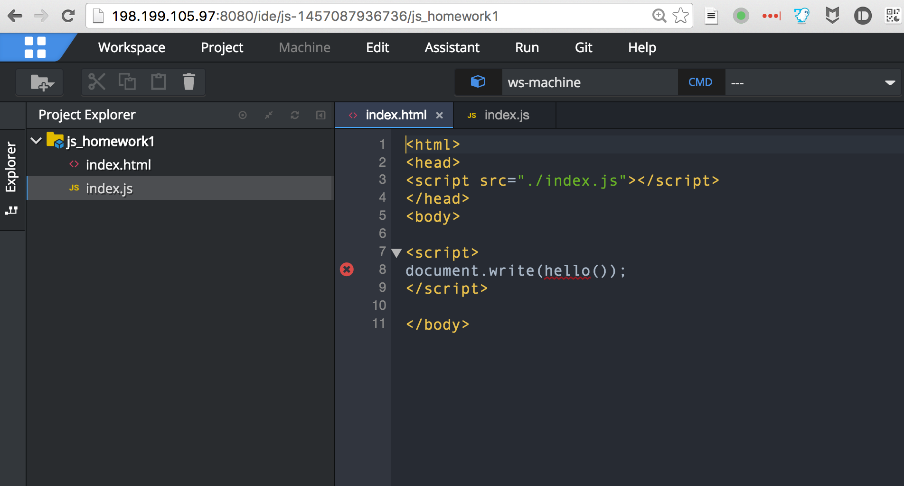
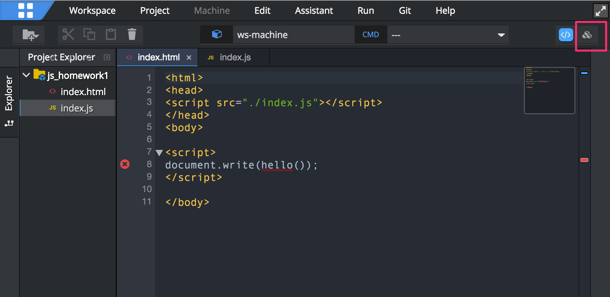
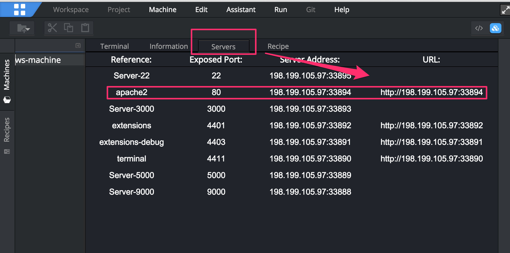
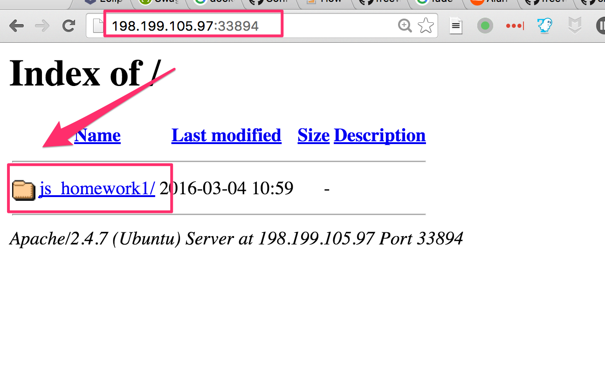
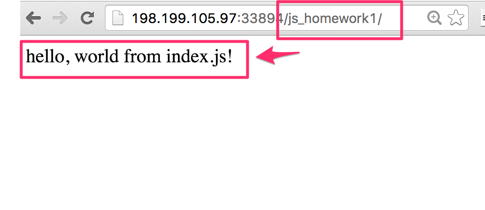
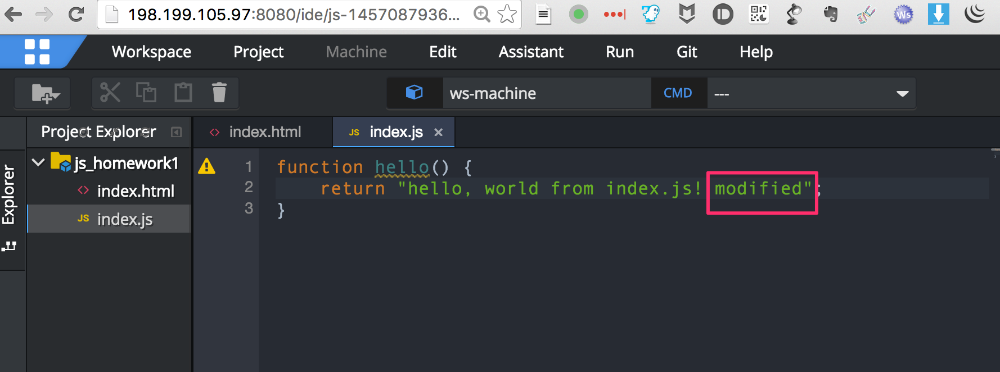
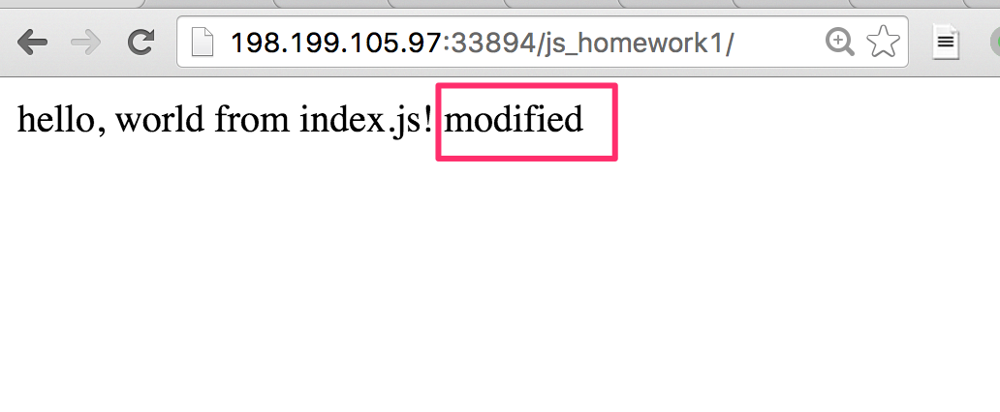

如何使用CHE来开发JS项目
====================

由于che当时没有默认提供前端JS项目对应的recipe，我们自己创建了一个：<https://github.com/freewind/dockerfiles/blob/add-stack-js_frontend/js_frontend/ubuntu/Dockerfile>，里面使用了apache作为web server，使得我们可以比较方便的预览我们项目中的html/js等文件。

下图是使用<https://github.com/freewind/che-operations/blob/master/create-js-project.js>创建的project，里面已经包含了一个简单的js项目：

我们可以对其中的html和js文件进行编辑。

如何预览文件
-----------

如果需要预览，则需要打开该workspace对应的apache服务器进行查看。

我们需要如下图所示，点击右上角的服务按钮：

然后打开其中的`Servers`面板，可以看到其中的apache2向外暴露的可访问端口为`33894`（注意，该端口随机，你的可能不一样）：

在浏览器中打开<http://198.199.105.97:33894/>后，可以看到列出了当前workspace下的所有项目：

点击其中的`js_homework1`项目，即可访问其`index.html`文件，显示如下：

预览修改
-------

我们可以修改我们的js/html文件：

然后在浏览器中刷新，即可看到最新效果：

如何把代码提交到github上
----------------

[参考这里，把我们的代码提交到github上](./23.如何通过git push把代码上传到github.md)
