如何使用CHE来开发Java项目
======================

刚刚发现使用CHE Dashboard创建的Java项目，里面的Java文件是支持语法检查错误提示的，但是我们通过<https://github.com/freewind/che-operations/blob/master/create-java-project.js>创建的不支持。

简单的看了一下，应该是我们通过API创建的项目没有被认为是一个“Java类型”项目，但是还没有找到原因，看来到时候需要再研究一下API。

由于Java项目的调试功能只有在Java类型的项目中才能生效，所以这里以使用Che Dashboard创建的Java项目为例。

Java文件的编辑与修改
-----------------

下面是一个典型的Java项目的样子：

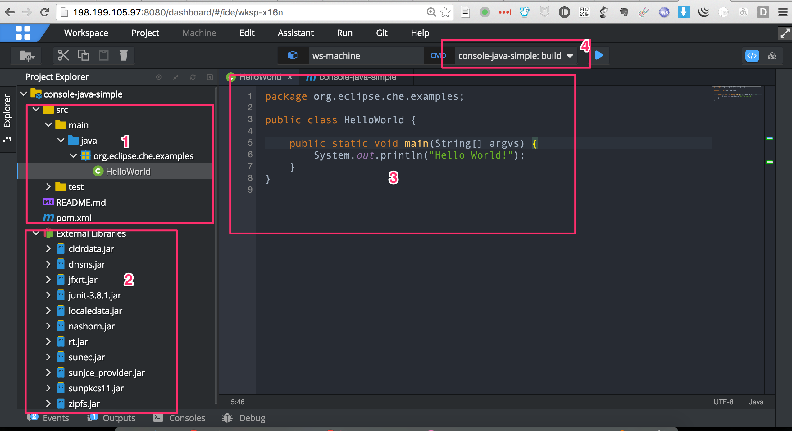

其中：

1. `1`处为文件树，注意`java`目录的图标是蓝色的，它已经被认为是一个Java源目录，里面的`org.eclipse.che.examples`也是以package的形式展示的
2. `2`处是依赖的包。该项目是一个maven项目，在打开的时候，已经下载了各依赖的jar包，并且显示在了这里
3. `3`处是文件内容，可以修改编辑
4. `4`处是可以执行的命令，如`build`和`run`等，它们实际上是一个`mvn`命令

我们可以直接在文件中修改内容，就跟我们使用其它的编辑器一样。目前CHE IDE提供了简单的语法检查、重构等功能：

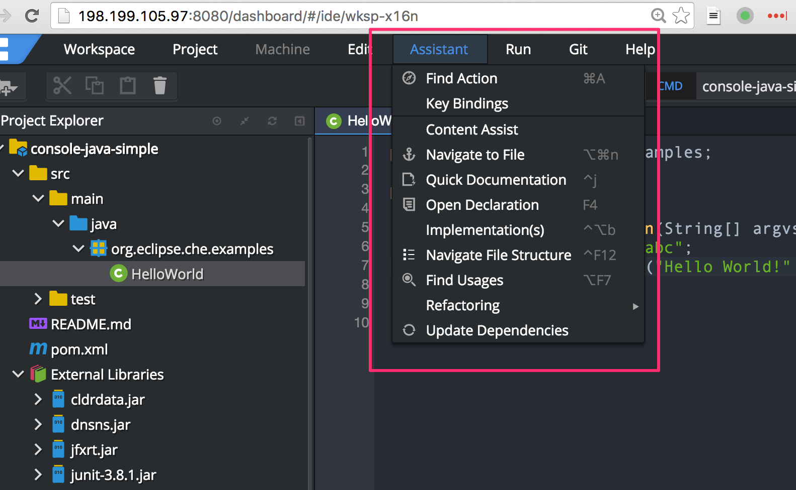

语法检查：

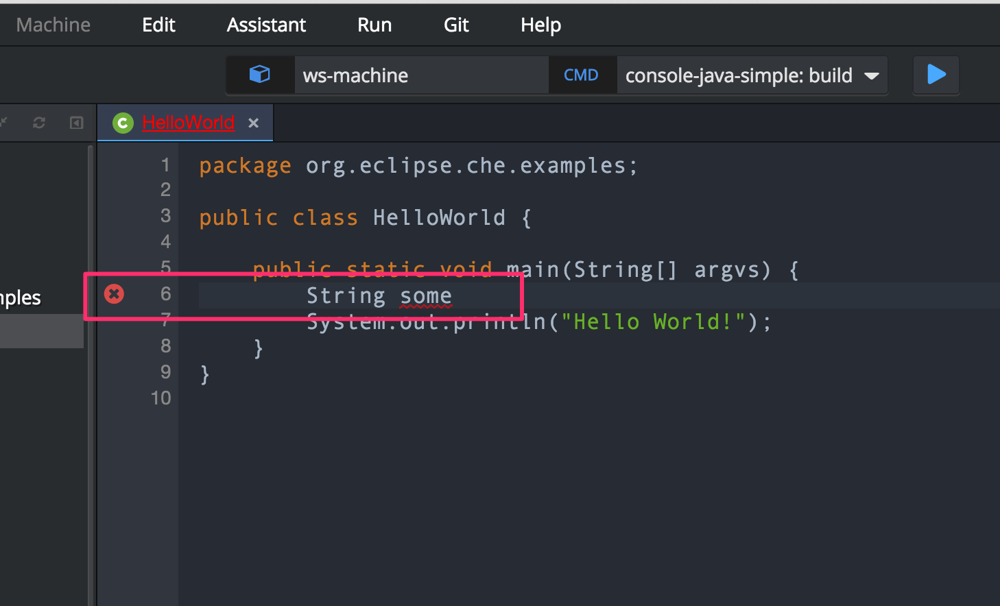

重命名变量：

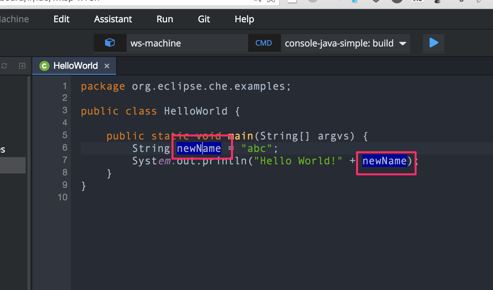

执行命令
------

在执行命令方面，CHE还不能跟传统的IDE相比。比如我们还没有办法直接运行一个Java文件，或者直接运行一个测试。目前只能够通过调用一些maven命令来执行代码的编译、运行测试、执行某个Java文件等功能。

已经默认提供的两个命令是这样的：

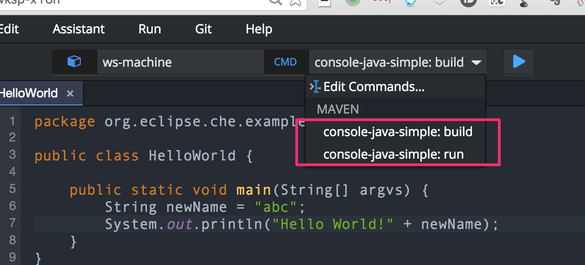

### console-java-simple: build

其内容为`clean install`，它会下载所有的依赖，并对代码进行编译、运行测试，并构建出相应的jar包

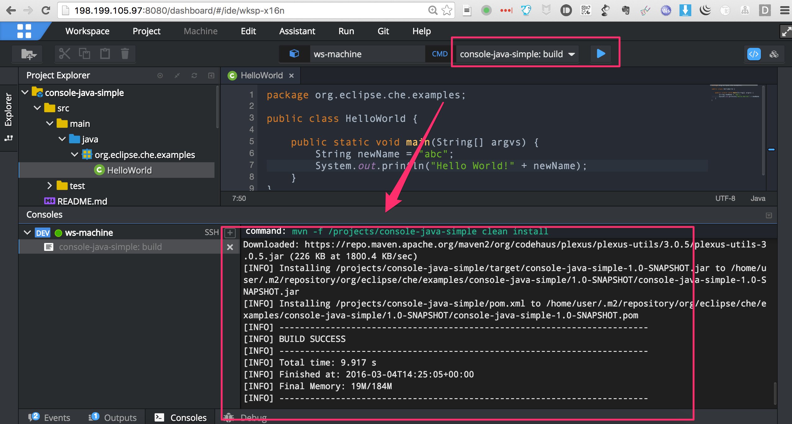

### console-java-simple: run

其内容为`clean install && java -jar ${current.project.path}/target/*.jar`，主要是在打出包后，执行其中的某个具有`public static void main`的Java文件。

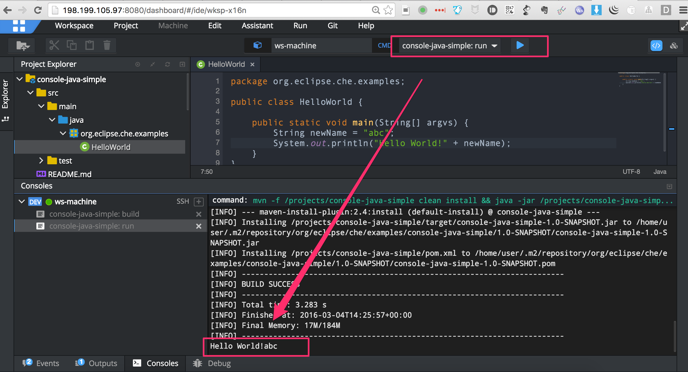

可以看到最后打出了`Hello World!abc`的内容。

如何把代码提交到github上
----------------

[参考这里，把我们的代码提交到github上](./23.如何通过git push把代码上传到github.md)

如何进行调试
----------

Che IDE的调试也不能像常用的IDE那样，直接使用一个命令即可实现，它还是依赖于使用maven执行代码，开启远程调试功能。

首先我们要添加一个`debug`的command: `clean install && java -jar -Xdebug -Xrunjdwp:transport=dt_socket,address=18000,server=y,suspend=y ${current.project.path}/target/*.jar`。注意在这里我们使用了端口`18000`，为了避免冲突，你也可以随机选择另一个端口`1025~65535`之间的未使用的端口。

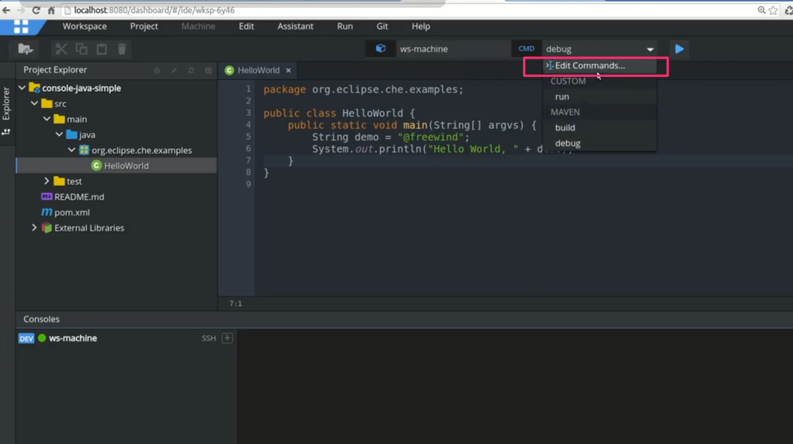

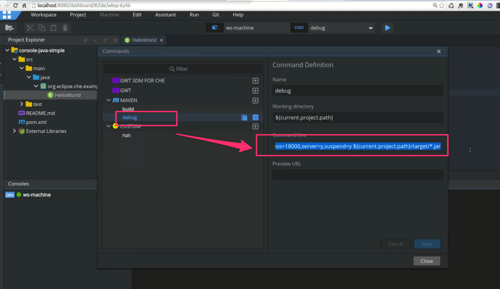

然后先在文件编辑面板中设置好断点，可以在某一行的左边单击一次即可，成功后颜色会变灰：

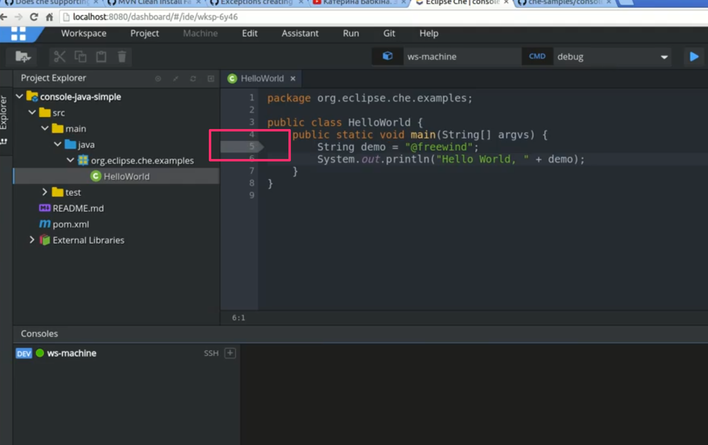

然后在命令下拉列表里刚刚定义的`debug`，并点击右边的蓝色三角按钮执行，可以看到下面的Consoles面板中有大量输出，最后显示成功的监听在`18000`端口上(如果提示错误，可能说明该端口被别人占用，可以换个端口再试)：

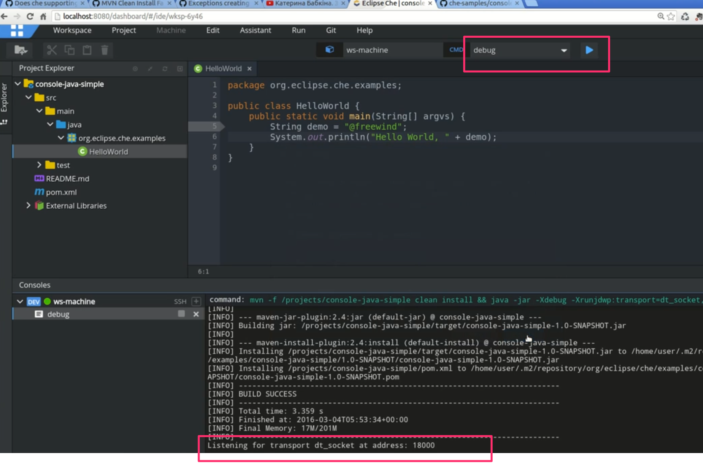

然后打开远程调试的菜单，单击“Remote Debug”：

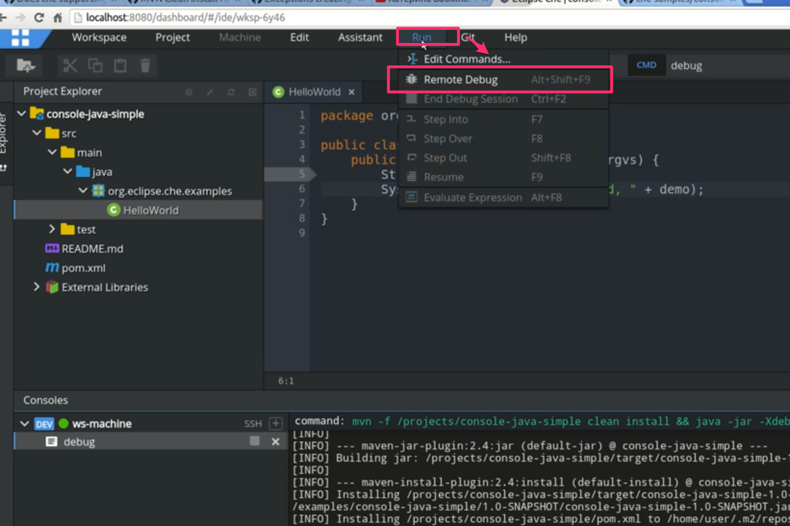

在弹出的对话框里输入端口号`18000`，单击`OK`按钮：

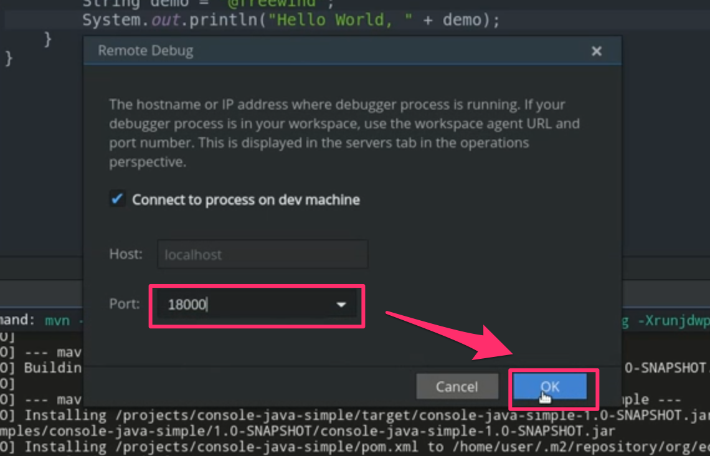

当连接成功后，代码会执行到断点那一行并暂停，可以看到该行背景为红色。并且在下面会显示断点的位置，以及当前可见的各种变量的值：

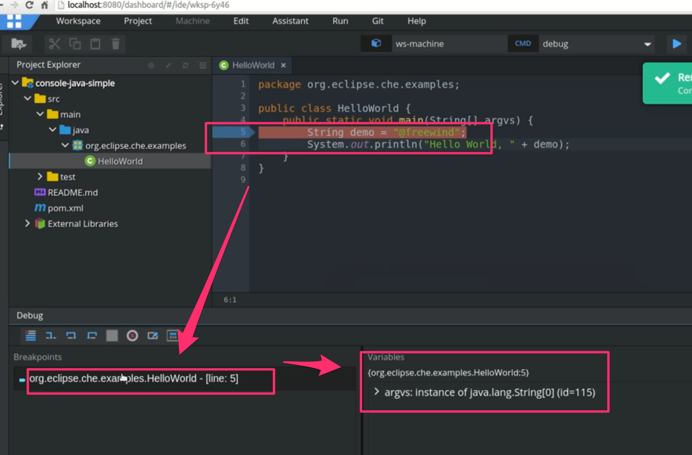

我们可以点击下方debug面板上的相应按钮，让程序运行到下一行。此时可以看到下方`Variables`区的变量发生了变化：

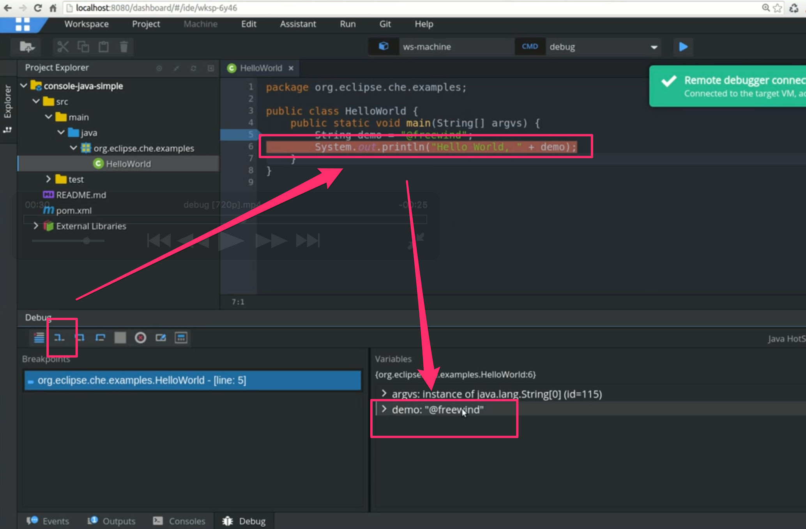

其它的调试操作和我们使用eclipse/IntelliJ IDEA等非常相似，这里就不再多说。注意由于Che IDE的限制，我们在调试过程中不要修改代码，改动的内容不会生效。

最后可以单击“停止”按钮结束调试：

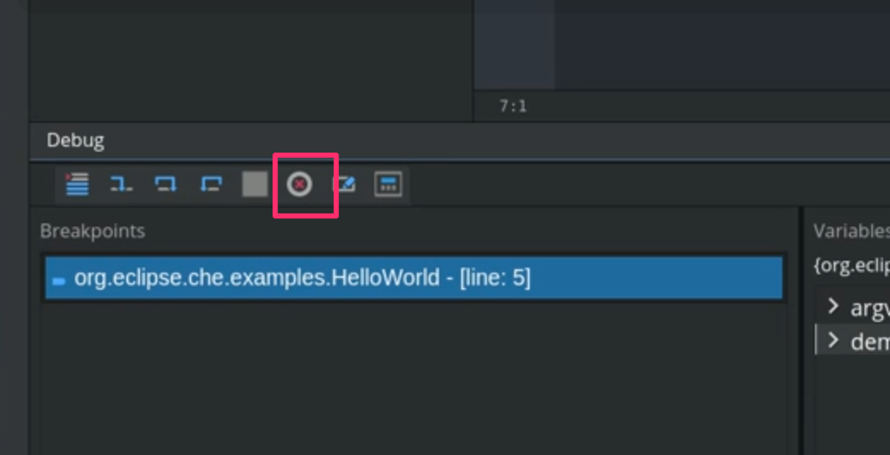

注意
----

注意远程调试功能目前还存在bug，请关注该issue的进展：<https://github.com/eclipse/che/issues/626>

