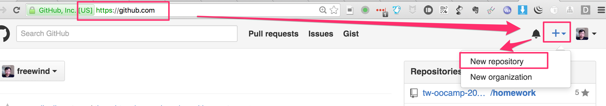
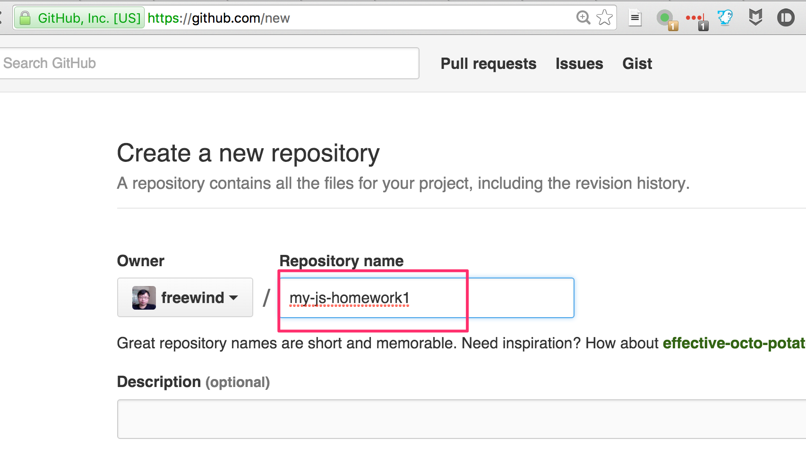
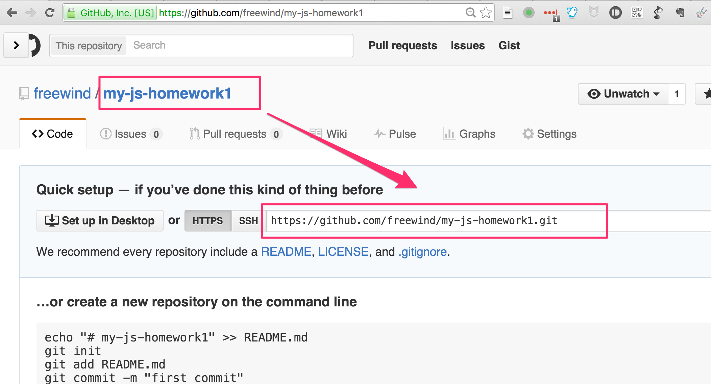
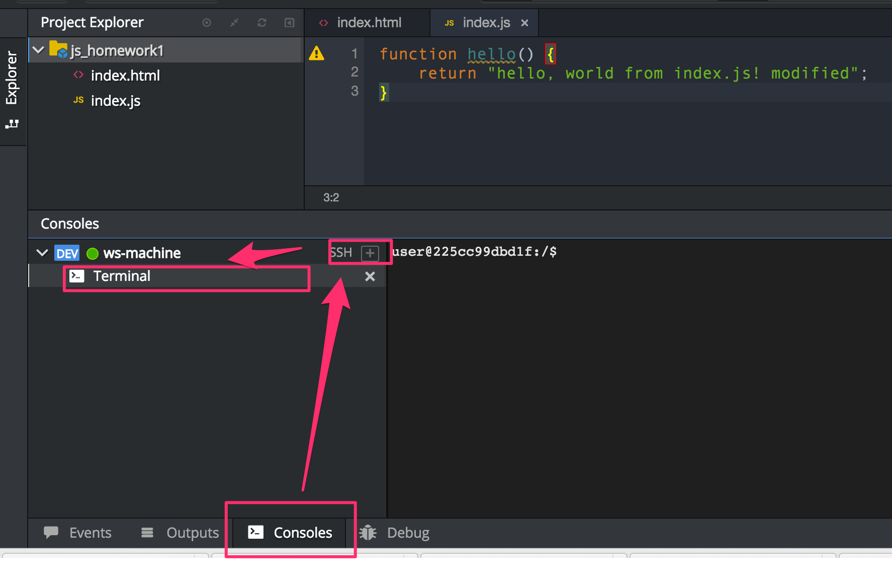

如何通过git push把代码上传到github
===============================

当我们在Che的IDE中编辑完代码后，我们可以把它提交到自己的github仓库中。这里要说明一下怎么做。

首先我们需要在github上创建一个空的仓库
--------------------------------

这里以`my-js-homework1`为例。打开<http://github.com>并登录，然后点击右上角的“New repository”按钮：



输入项目名，这里以`my-js-homework1`为例：



记下生成的git提交地址`https://github.com/freewind/my-js-homework1.git`(注意为了提交方便，请选择`https`的，不要选择`git`的)：



在Che IDE中提交
-------------

Che IDE的菜单中虽然提供了`git`相关的选项，但是不太好用，并且由于che在github验证方面的设计所限，无法让用户随意连接到自己的github帐号，所以我们需要使用Che IDE提供的Terminal功能，来手动提交。

### 打开Terminal面板

首先打开Che IDE的Terminal面板：



然后在terminal面板中进入当前项目（假设是`js_homework1`）：

```
cd /projects/js_homework1
```

如果你对git操作比较熟悉，现在就已经知道该怎么做了。

如果不熟悉的话，可以参考下面的介绍。

### 使用git命令提交

注意由于该Terminal的限制，不能复制粘贴，只能手动输入，需要小心输入下面的命令。

在git中设置自己的信息，这是git要求的（注意使用你自己的email和名字，不要使用中文）

```
git config --global user.email "my@email.com"
git config --global user.name "myname"
```

将你在github上创建的仓库的提交地址加到项目中（注意地址以`.git`结尾）：

```
git remote add my-repo https://github.com/freewind/my-js-homework1.git
```

然后提交代码：

```
cd /projects/js_homework1
git add .
git commit -m 'finished'
git push my-repo master
```

这里它会提示你输入你在github.com上的用户名和密码。输入并回车后，如果正确的话，你的代码就会被推送到github上。

最后在github.com上打开你刚才创建的项目，检查上面的代码是否是最新的代码即可。


