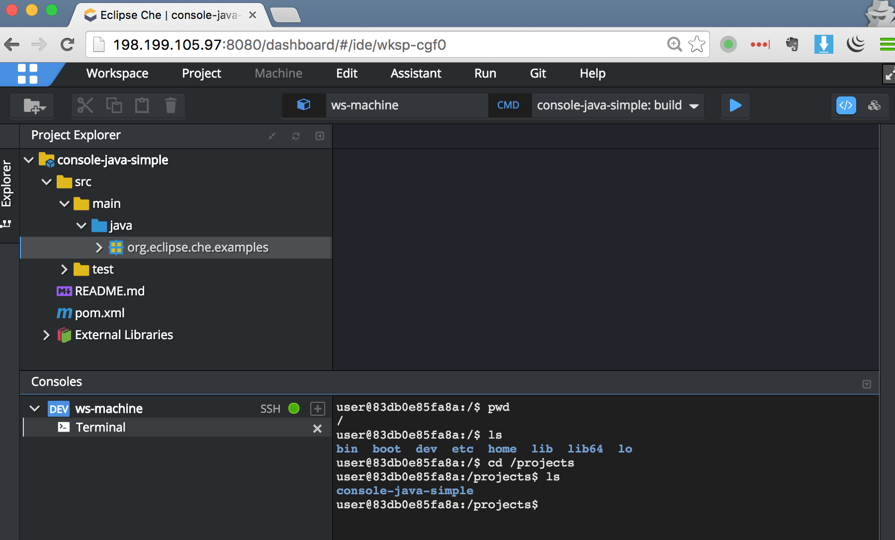
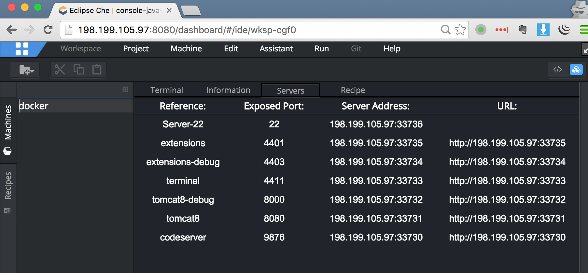
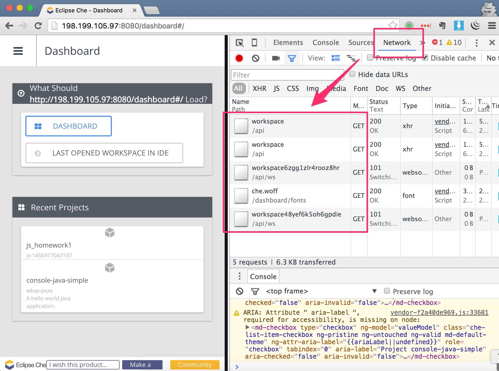
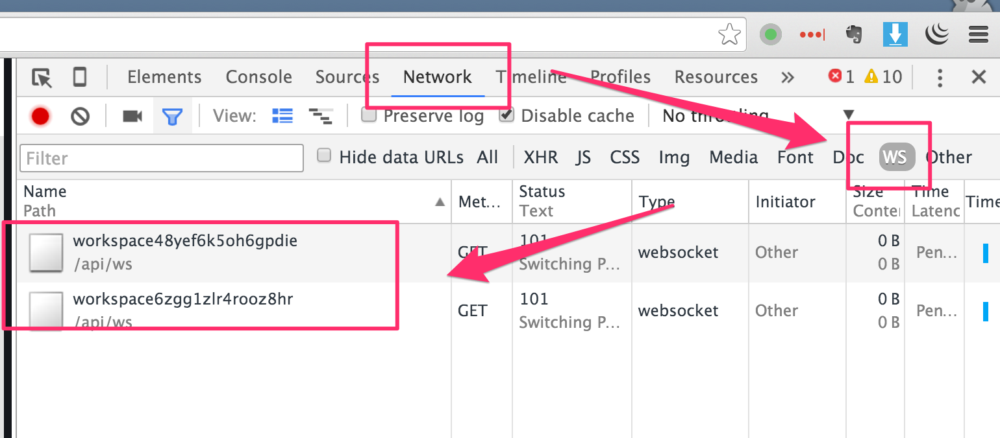
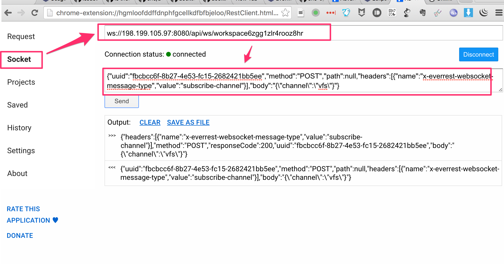
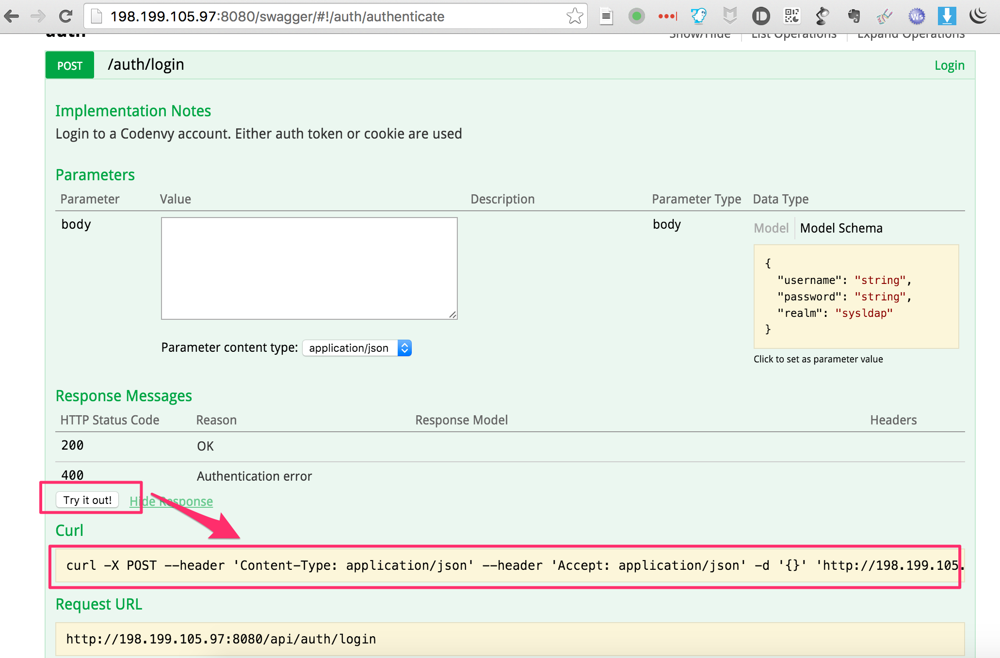

Eclipse CHE 笔记
===============

重要资源
-------

1. 官网：<https://eclipse.org/che>
2. 代码：<https://github.com/eclipse/che>，另外在`eclipse`名下还有四五个以`che_`开头的仓库，也属于che
3. 文档：<https://eclipse-che.readme.io/docs/>，重中之重。CHE的架构非常灵活，里面有很多概念，在这些文档里对它们解释的非常清楚。在看这篇笔记的同时，一定要先把文档详细读一遍。
4. 我提的各种问题（有些还有价值，有些已经过时）：<https://github.com/eclipse/che/issues?utf8=%E2%9C%93&q=+author%3Afreewind+>

服务器安装前的准备工作
--------------------

### 1. 操作系统请选择ubuntu 14.04 x64

因为我们在该版本的操作系统上进行了大量的尝试，解决了很多问题。如果使用其它系统，可能会遇到不同的问题。

### 2. 添加一个非root用户

由于安全原因，及后面安装`docker`的需要，我们需要添加一个非root用户，这里使用`twer`这个名字。

```
adduser twer
adduser twer sudo
passwd twer
```

然后根据提示输入密码。

由于后面的操作将在`twer`下进行，所以我们要转到该帐户下。

```
su twer
```

### 3. 安装docker


```
wget -qO- https://get.docker.com/ | sh
```


需要将`twer`这个用户加入到`docker`组中，方便操作：

```
sudo usermod -aG docker twer
```

注意，你必须退出`twer`再重新登录进来才生效。

然后检查是否安装成功：

```
docker run hello-world
```

如果一切顺利的话，你会看到一些执行日志及运行成功的提示信息。

### 4. 设置文件的最大可连接数

很多系统默认的“文件最大可连接数”以及“最大进程数”等都比较小(`1024`)，导致che在运行过程中，很容易出现`Too many open files`的错误，无法正常运行。

使用以下命令查看：

```
ulimit -a
```

我们可以给它设置一个比较大的值：

```
sudo vi /etc/security/limits.conf
```

在最后加入以下行：

```
*                hard    nofile          100000
*                soft    nofile          100000

*                hard    nproc           100000
*                soft    nproc           100000
```

这样其数值设为了`100000`，基本够用。

### 5. 设置交换内存

che对于服务器的CPU和内存要求都比较高。这是因为每当建立一个workspace，che都需要以docker container的方式为它创建一个workspace machine，并且每个machine里都要运行一个tomcat8启动的代理程序。并且由于workspace machine由于是运行项目代码用的，其内存将根据项目类型和规模有不同的要求。比如对于js项目，内存设为`128M`即可，但对于Java项目，可能得`1G`以上。

通常服务商提供的服务器，其交换内存默认为0，导致内存基本不够用。

使用`top`命令查看：

```
top - 07:12:18 up 22:25,  3 users,  load average: 1.79, 0.62, 0.26
Tasks: 112 total,   3 running, 109 sleeping,   0 stopped,   0 zombie
%Cpu(s): 91.7 us,  8.0 sy,  0.0 ni,  0.0 id,  0.3 wa,  0.0 hi,  0.0 si,  0.0 st
KiB Mem:   2048484 total,  1888816 used,   159668 free,     1232 buffers
KiB Swap:        0 total,        0 used,        0 free.   304788 cached Mem
```

`KiB Mem`那行显示我们有2G的内存，最后一行`KiB Swap`显示交换内存为`0`。

我们可以按以下方式给服务器增加`4G`左右的内存：

```
# 4G
sudo mkdir -p /media/fasthdd/
sudo dd if=/dev/zero of=/media/fasthdd/swapfile.img bs=400 count=10M
sudo mkswap /media/fasthdd/swapfile.img
# Add this line to /etc/fstab /media/fasthdd/swapfile.img swap swap sw 0 0
sudo swapon /media/fasthdd/swapfile.img
```

另外需要注意的是，对于che server来说，CPU和内存都是瓶颈。我们在digital的`4G RAM`的主机上测试，最多只能同时跑7个最简单的workspace machine，再多的话，就算内存够用，CPU也支持不了了，这时就需要换更强的CPU了。

### 6. 安装haveged

在某些服务器上（如digital ocean）启动che，其中的tomcat经常（但不是每次）会特别慢，超过20分钟甚至一个小时才完成。

这除了浪费大量的时间外，还会导致很多奇怪的问题。比如在dashboard中创建project时，che会向创建的workspace machine中植入一个代理程序（一个tomcat+war）并启动它，然后等待少许后便访问其api来检查是否成功。由于tomcat启动的时间太长，会导致检查失败从而无法创建项目。

解决方法是在digital ocean上安装：

    apt-get install haveged

之后tomcat的启动时间将会缩短到10秒左右。

该问题的详细讨论在这里：https://www.digitalocean.com/community/questions/fresh-tomcat-takes-loong-time-to-start-up

### 现在可以用docker跑che了

经过以上的配置，我们就可以在这台服务器上以docker的形式来运行che了。

但是如果我们想在该服务器上以本地Java程序的方式运行che，或者有时候还想编译一下che等，这时我们还需要安装以下软件：

### 7. 安装Java

必须是jdk1.8或以上

```
$ sudo add-apt-repository ppa:webupd8team/java
$ sudo apt-get update
$ sudo apt-get install oracle-java8-installer
```

检查java版本：

```
java -version
```


### 8. 安装Maven

目前需要3.3.x

```
mkdir downloads
cd downloads
wget http://mirrors.sonic.net/apache/maven/maven-3/3.3.3/binaries/apache-maven-3.3.3-bin.tar.gz
tar -zxf apache-maven-3.3.3-bin.tar.gz
sudo cp -R apache-maven-3.3.3 /usr/local
sudo ln -s /usr/local/apache-maven-3.3.3/bin/mvn /usr/bin/mvn
```

检查mvn版本：

```
mvn --version
```

如何启动che
-----------

### 1. 特别注意

在使用类似于`codenvy/che:nightly`这样内容会不断变化的image时，最好先把旧的删除，否则可能出现引用的还是旧image的情况。可参见我当时遇到的问题：<https://github.com/eclipse/che/issues/609

### 2. 使用docker启动

我们推荐使用docker来启动，这样对环境的依赖最小。我们当前使用的启动命令如下：

```
docker run -ti --net=host 
    -v /var/run/docker.sock:/var/run/docker.sock 
    -v /home/user/che/lib:/home/user/che/lib-copy 
    -v /home/user/che/workspaces:/home/user/che/workspaces 
    -v /home/user/che/tomcat/temp/local-storage:/home/user/che/tomcat/temp/local-storage 
    -e CHE_DOCKER_MACHINE_HOST=198.199.105.97 
    codenvy/che:nightly
```

随着che的更新，这个命令可能也需要跟着更新，具体可参考官方文档：<https://eclipse-che.readme.io/docs/usage-docker>

这里面有几个需要注意的点：

1. `-e DOCKER_MACHINE_HOST=198.199.105.97` 这是非常重要的一步。当我们使用浏览器的机器与che运行的机器不在同一台机器上时，就必须设置这个参数，否则不能正常工作，这个问题曾经困扰了我们很久。后面的ip就是运行che的服务器的ip。这个参数与`che.sh`的`-r:198.199.105.97`作用是一样的

2. `-v /var/run/docker.sock:/var/run/docker.sock` 这也是非常重要的一个参数。这样使得che可以在内部复用外面提供的docker来创建各workspace machine，从而避免了docker in docker所带来的各种问题

3. `--net=host` 这个参数使用我们不需要像以前那样在启动docker时传入一大堆的端口映射的配置了。结合che自己内部的操作，它可以自己将服务器上的某个端口映射到某个workspace machine中的端口，非常方便

4. 多个类似于`-v /home/user/che/lib:/home/user/che/lib-copy`的配置，是为了让用户产生的数据保存在服务器上，不会因为che docker container的重启而丢失。比如创建的workspace和project，及项目文件等。注意我们如果需要，还可以把maven的缓存目录如`~/.m2`等，也挂载上去

### 3. 以Java方式启动

除了docker以外，还可以选择[下载打好的che包](https://www.eclipse.org/che/download/)，或者[从源代码编译](https://github.com/eclipse/che/tree/master/assembly)，然后以java程序的方式来运行。

在这种情况下，我们通常会使用`che.sh`脚本来启动。`che.sh`为了简化操作，里面提供了很多选项，具体可以细看这个文档：<https://eclipse-che.readme.io/docs/usage>

注意使用`che.sh`时除了可以以Java形式来运行，还可以通过`-i`来运行一个官方提供的docker image。

如何访问che
-----------

启动che后，我们就可以打开浏览器，输入：<http://198.199.105.97:8080>。

默认情况下，它会打开`/dashboard`页面，我们可以来创建一些workspace或者project，之后就可以打开IDE页面，进行文件的编辑，以及运行各种命令。

一些值得注意的功能：

### 1. Terminal

可以直接ssh到workspace machine，执行各种操作。

对于che来说是很好的功能补充，可以方便得做各种它没有提供或者不太好用的功能，比如git提交什么的。



### 2. 访问内部服务

每个workspace machine内部都可以有多个服务。如果我们在workspace对应的recipe里声明了需要暴露的端口后，che会自动把一个外部可访问的端口映射到machine中对应的内部端口。



比如在上图中，用户就可以访问：<http://198.199.105.97:33731> 来访问该machine中的`8080`端口。

从源代码编译并执行che
-------------------

有时候我们想直接以java程序的方式运行che，或者为了方便开发，我们需要手动编译che。这里介绍一下怎么做，以及会遇到什么问题。

### 1. 下载源代码

```
git clone https://github.com/eclipse/che.git
```

### 2. 编译

需要注意的是，che从codenvy名下移动eclipse后，把以前的多个仓库以目录的形式放在了同一个仓库中。

如果我们的目的仅仅是编译出最终的包，则需要进入`assembly`目录（而不是在根目录下）执行`mvn clean install`，即：

```
cd assembly
mvn clean install
```

如果成功的话，会看到类似于这样的输出：

```
[INFO] --- maven-install-plugin:2.5.2:install (default-install) @ assembly-main ---
[INFO] Installing /home/ubuntu/workspace/che/assembly/assembly-main/pom.xml to /home/ubuntu/.m2/repository/org/eclipse/che/assembly-main/4.0.0-RC10-SNAPSHOT/assembly-main-4.0.0-RC10-SNAPSHOT.pom
[INFO] Installing /home/ubuntu/workspace/che/assembly/assembly-main/target/eclipse-che-4.0.0-RC10-SNAPSHOT.zip to /home/ubuntu/.m2/repository/org/eclipse/che/assembly-main/4.0.0-RC10-SNAPSHOT/assembly-main-4.0.0-RC10-SNAPSHOT.zip
[INFO] Installing /home/ubuntu/workspace/che/assembly/assembly-main/target/eclipse-che-4.0.0-RC10-SNAPSHOT.tar.gz to /home/ubuntu/.m2/repository/org/eclipse/che/assembly-main/4.0.0-RC10-SNAPSHOT/assembly-main-4.0.0-RC10-SNAPSHOT.tar.gz
[INFO] ------------------------------------------------------------------------
[INFO] Reactor Summary:
[INFO]
[INFO] Che IDE :: Parent .................................. SUCCESS [  4.083 s]
[INFO] Che Machine Plugins :: Packaging ................... SUCCESS [ 20.541 s]
[INFO] Che Assembly Machine Plugins :: Server ............. SUCCESS [  2.615 s]
[INFO] Che IDE :: Compiling GWT Application ............... SUCCESS [06:05 min]
[INFO] Che IDE :: Assemblies Tomcat ....................... SUCCESS [03:06 min]
[INFO] ------------------------------------------------------------------------
[INFO] BUILD SUCCESS
[INFO] ------------------------------------------------------------------------
[INFO] Total time: 09:40 min
[INFO] Finished at: 2016-03-02T07:31:52+00:00
[INFO] Final Memory: 82M/1324M
[INFO] ------------------------------------------------------------------------
```

它将在`assembly/assembly-main/target`下打出相应的`.zip`和`.tar.gz`的包，同时也会有一个未压缩的目录，里面有`che.sh`可执行

#### 2.1 编译过程中出现OutOfMemoryError

由于che使用的是jdk 1.8，默认情况下MaxHeapSize是`4G`，在编译过程中通常不会出现`OutOfMemoryError`。

如果出现了，则可能是因为机器的总体可用内存不够。这时可以检查一下swap file的大小是多少，如果不够的话，可以再增加一些。

#### 2.2 避免重复下载SNAPSHOT

由于我们从源代码编译时，che的版本总是SNAPSHOT的，这就意味着每次maven可能都会去线上检查或者下载最新的。由于che模块众多，如果我们的服务器是在国内，下载这些依赖就会花费大量时间。

所以如果下载好一次后，我们并不希望再去下载新的SNAPSHOT依赖，可以加上`--offline`参数：

```
mvn clean install --offline
```

注意：有时候这种方法会失效，需要根据实际情况寻找对策。

### 3. 以java程序执行

以当前的源代码为例，执行完前一步的操作后，则可以找到如下的`che.sh`:

```
/home/twer/workspace/che/assembly/assembly-main/target/eclipse-che-4.0.0-RC9-SNAPSHOT/eclipse-che-4.0.0-RC9-SNAPSHOT/bin/che.sh
```

传入`-r:<server_ip>`后，即可执行：

```
./che.sh -r:198.199.105.97 run
```

`-r`参数与前面提到的`DOCKER_MACHINE_HOST`是一个作用。

Che的API
---------

che中有两种类型的API，一种是通过HTTP访问，另一种是通过websocket。这两种API的作用不太一样。

HTTP API更重要一些，用于让客户端来执行各种操作，以及查询各种信息。

Websocket API主要是用于持续监听某些在后台需要很长时间才能执行完的操作（比如start workspace等），每当服务器上该操作有了新的进展，它就会向某个websocket中的channel里发送一条信息，发送到监听者那里。

具体的API内容在这里不详细说明，在下面将会列出可供学习的地址。

### 1. HTTP API

我们部署完che后，可以访问该路径查看漂亮的api文档：<http://198.199.105.97:8080/swagger/>（注意最后一定要有一个`/`，否则页面显示不正常）

这里可以查看代码中暴露出来的API，即可以查看，又可以**运行**，比较方便。

注意它暴露出来的API并不全面，有一些API还需要在Java代码里查看。可以通过在Java代码中搜索`@Path`来查找。

这些API中，目前对我们最重要的应该是`/workspace`下面的各个API。

### 2. Websocket API

websocket的API并没有像HTTP API那样漂亮的文档可供查看，在官方文档<https://eclipse-che.readme.io/docs/events>里有一些介绍，但我们有需要的时候，还是需要查看源代码，以及自己通过试验的方式来探索。这里会稍麻烦一些，需要认真追踪che的代码。

在<https://github.com/freewind/che-operations/blob/master/create-project.js#L57>这个例子里，展示了websocket api的用法。

如何通过API来创建workspace和project
--------------------------------

Che提供了dashboard，可供我们来管理和创建workspace和project等，其地址为：<198.199.105.97:8080/dashboard>

但是如果我们要把它集成到某个工具中，则需要在脚本中以API的方式来调用。

我们已经有了可以运行的例子，参见：<https://github.com/freewind/che-operations/blob/master/create-project.js>

这里我把其基本流程简单介绍一下，详细的可以直接看代码：

1. 首先要访问`http://198.199.105.97:8080/api/auth/login`，登录一下。虽然在che的开源代码中弱化了帐号相关的功能，但是还是需要登录之后，才能调用其它的API。我们不需要传入任何用户名或密码都可以登录成功

2. 调用`http://198.199.105.97:8080/api/workspace/config`并传入合适的参数，来创建一个workspace。这时只是创建，并没有启动

3. 然后调用`http://198.199.105.97:8080/api/workspace/<workspaceId>/runtime`来启动该workspace。这是一个比较漫长的过程，因为server可能要docker pull某个image，并且要植入并启动代理程序。所以该操作被设计成为一个异步任务，对于客户端请求会很快返回

4. 然后就要使用websocket api了。通过监听`ws://198.199.105.97:8080/api/ws/<workspaceId>`，在正常的情况下，会慢慢收到多条消息，检查消息类型是`RUNNING`还是`ERROR`

5. 等workspace启动成功后，访问`http://198.199.105.97:8080/api/ext/project/<workspaceId>/import/<projectName>`并传入模板项目的git地址，把指定的项目导入到workspace中

6. 如果该项目有一些预定义的命令（比如Java项目，可以预定义一些mvn命令），可以通过`http://198.199.105.97:8080/api/workspace/<workspaceId>/command`来创建

如何使用Chrome及其它工具来监听请求
---------------------

### 1. HTTP请求



### 2. Websocket请求




### 3. Advanced REST Client

安装地址：<https://chrome.google.com/webstore/detail/advanced-rest-client/hgmloofddffdnphfgcellkdfbfbjeloo/reviews?hl=en-US&utm_source=ARC>



### 4. curl

curl比较常用，不详细说明了。提示，我们可以在<http://198.199.105.97:8080/swagger/>里执行了某个API后，它会把对应的`curl`的代码显示出来，非常贴心。



```
curl -X POST --header 'Content-Type: application/json' --header 'Accept: application/json' -d '{}' 'http://198.199.105.97:8080/api/auth/login'
```

### 5. wscat

这是一个websocket的命令行工具，它的功能比前面介绍的Advanced REST Client更加强大。比如wscat还支持subprotocol，而Advanced REST Client不支持。但在我们这里，目前还用不上这个功能。

安装：

```
npm install -g wscat
```

使用：

```
~ $ wscat -c ws://198.199.105.97:8080/api/ws/workspace6zgg1zlr4rooz8hr
connected (press CTRL+C to quit)
> {"uuid":"fbcbcc6f-8b27-4e53-fc15-2682421bb5ee","method":"POST","path":null,"headers":[{"name":"x-everrest-websocket-message-type","value":"subscribe-channel"}],"body":"{\"channel\":\"vfs\"}"}
  < {"headers":[{"name":"x-everrest-websocket-message-type","value":"subscribe-channel"}],"method":"POST","responseCode":200,"uuid":"fbcbcc6f-8b27-4e53-fc15-2682421bb5ee","body":"{\"channel\":\"vfs\"}"}
>
```

如何查看各种日志
--------------

che的架构很灵活，日志也分散在多个地方。并且有的与docker相关，有的与tomcat，或者其它软件相关。

### 1. docker相关的操作

由于che中大量使用docker，我们先回顾一下常用的docker操作。

查看正在运行的docker container:

```
docker ps
```

查看全部docker container，包括已经关闭的：

```
docker ps -a
```

只显示docker container id:

```
docker ps -q
```

这样我们就可以快速`kill`或者`rm`多个docker container了:

```bash
docker kill `docker ps -q`
docker rm -f `docker ps -aq`
```

### 2. 查看docker container的日志

先拿到docker container的id：

```
$ docker ps
CONTAINER ID        IMAGE                      COMMAND                  CREATED              STATUS              PORTS               NAMES
0afab24b324e        nowind/che:good-20160216   "/bin/sh -c 'sudo rm "   About a minute ago   Up About a minute                       stoic_heyrovsky
```

然后查看日志：

```
docker logs 0afab24b324e
```

或者同时监控新的日志：

```
docker logs -f 0afab24b324e
```

注意，我们可以只输入container id的前几位来简化操作，只要匹配上的只有一个，就没有问题：

```
docker logs -f 0af
```


### 3. 如何进入一个docker container

如果我们的che是通过docker执行的，或者需要进入一个workspace machine，我们就需要先进去才能看到日志。

```
docker exec -it 0afab24b324e bash 
```

这样就进入到该container内部，可以对它进行各种各样的linux操作了。

### 4. tomcat日志

che中的大部分操作都在tomcat中，所以日志也主要集中在tomcat的日志文件里。

che的目录结构是这样的（只显示2层）：

```
$ tree -L 2 .
.
|-- bin
|   |-- che.bat
|   |-- che-install-plugin.bat
|   |-- che-install-plugin.sh
|   `-- che.sh
|-- conf
|   `-- che.properties
|-- lib
|   |-- terminal
|   `-- ws-agent.zip
|-- LICENSE
|-- plugins
|   |-- examples
|   |-- ide
|   |-- README
|   |-- ws-agent
|   `-- ws-master
|-- README
|-- sdk
|   |-- assembly-ide-war
|   |-- assembly-machine-server
|   |-- assembly-machine-war
|   |-- assembly-main
|   |-- che-plugin-sdk-logger-core.jar
|   |-- che-plugin-sdk-logger.jar
|   `-- che-plugin-sdk-tools.jar
|-- stacks
|   |-- predefined-stacks.json
|   `-- stack_img
|-- templates
|   `-- samples.json
`-- tomcat
    |-- bin
    |-- conf
    |-- endorsed
    |-- lib
    |-- LICENSE
    |-- LICENSE-logback.txt
    |-- LICENSE-mit.txt
    |-- LICENSE-slf4j.txt
    |-- logs
    |-- NOTICE
    |-- RELEASE-NOTES
    |-- RUNNING.txt
    |-- temp
    |-- webapps
    `-- work
```

其中tomcat的日志在`/tomcat/logs`下面，按`yyyy/MM/dd`分组后，有两个：

- `catalina-?.log` tomcat本身的执行日志，各种运行信息和异常信息
- `localhost-access-?.log` 客户端的http访问记录

### 5. docker中运行的che的日志路径

docker中运行的che路径是固定的：

```
/home/user/che
```

则其tomcat logs路径为：

```
/home/user/che/tomcat/logs/machine/logs
```

### 6. apache的日志地址

我们的js项目使用的workspace machine中运行了apache来提供页面访问，其日志路径为：

```
/var/log/apache2
```

注意，需要使用root身份才能进入该目录，但是由于某些[不明原因](https://github.com/docker/docker/issues/5899)，在workspace machine中似乎不能切换为root，好在可以使用这样的方式来查看：

```
sudo ls -al /var/log/apache2
```

显示类似于：

```
-rw-r-----  1 root adm    1424 Mar  2 12:37 access.log
-rw-r-----  1 root adm     274 Mar  2 12:35 error.log
-rw-r-----  1 root adm       0 Feb 24 09:11 other_vhosts_access.log
```

然后：

```
sudo tail -F /var/log/apache2/access.log
sudo tail -F /var/log/apache2/error.log
sudo tail -F /var/log/apache2/other_vhosts_access.log
```

### 7. 如何将che server中tomcat的日志级别调到debug

tomcat的logger默认级别是`info`。有时为了方便调试，我们需要把logger设为`debug`，以便输出更多的Java日志。

如果我们在是docker中启动的che，那么tomcat的配置文件地址是：`/home/user/che/tomcat/conf/logback.xml`。我们可以利用docker的`-v`来让它使用我们自定义的配置文件：

```
wget https://raw.githubusercontent.com/eclipse/che-lib/master/che-tomcat8-slf4j-logback/src/assembly/conf/logback.xml
```

对它进行修改后，在启动che的时候可以加上这个参数：

```
-v path/to/logback.xml:/home/user/che/tomcat/conf/logback.xml
```

更多办法可以参考这个issue: <https://github.com/eclipse/che/issues/613>

### 8. 如何将workspace machine中植入的tomcat的日志级别调到debug

当我们创建workspace时，che server会在内部启动一个docker container，并且将`lib/ws-agent.zip`植入进去。

相对于直接修改che server的tomcat，这种情况要复杂一些。我目前想到的办法是这样的：首先使用docker启动一个che，然后进入该container把它的`/home/user/che/lib/ws-agent.zip`拷贝出来，修改其中的`logback.xml`并重新打好包。然后重新启动che时，使用`-v path/to/modified/ws-agent.zip:/home/user/che/lib/ws-agent.zip`，这样就可以使用workspace machine中使用修改过的ws-agent了。

将docker container中的文件拷贝到外面的命令是:

```
docker cp <containerId>:/file/path/within/container /host/path/target
```

### 9. 如何知道che的docker image里有什么

在这里：<https://github.com/eclipse/che/blob/master/Dockerfile>

### 10. 如何知道workspace machine里有什么

每个workspace都对应了一个recipe，里面定义了这个workspace是什么语言，需要安装什么软件，暴露哪些端口等等。

官方所有的定义都在这里：<https://github.com/codenvy/dockerfiles>

比如java项目中最常用的`ubuntu_jdk8`: <https://github.com/codenvy/dockerfiles/tree/master/ubuntu_jdk8>

我们自定义的js前端: <https://github.com/freewind/dockerfiles/blob/add-stack-js_frontend/js_frontend/ubuntu/Dockerfile>
